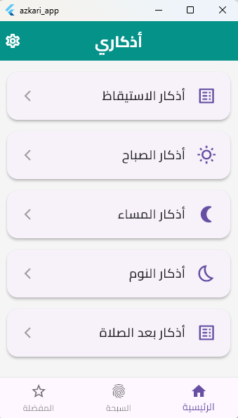
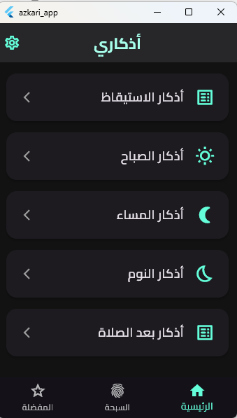

# تطبيق أذكاري | Azkari App


تطبيق "أذكاري" هو تطبيق جوال مفتوح المصدر تم تطويره باستخدام إطار عمل Flutter. يهدف التطبيق إلى توفير تجربة بسيطة وعملية للمستخدم لقراءة الأذكار اليومية والتسبيح، مع التركيز على سهولة الاستخدام، والأداء العالي، والعمل بكفاءة دون الحاجة لاتصال بالإنترنت.

---

## 🌟 الميزات الرئيسية

- **قراءة الأذكار:** عرض الأذكار اليومية مصنفة (أذكار الصباح، المساء، بعد الصلاة، إلخ).
- **عداد تفاعلي:** عداد لكل ذكر مع مؤشر تقدم مرئي واهتزاز خفيف عند الضغط.
- **سبحة إلكترونية ذكية:** عداد تسبيح مع قائمة تسابيح جاهزة، وإمكانية إضافة تسابيح خاصة وحذفها.
- **تتبع الاستخدام اليومي:** علامة (✓) تظهر بجانب التسابيح التي تم استخدامها خلال اليوم.
- **ميزة المفضلة:** تمييز الأذكار المهمة للوصول إليها بسرعة في شاشة مخصصة.
- **تخصيص كامل:**
  - دعم الوضع الفاتح والداكن ووضع النظام.
  - التحكم في حجم خط الأذكار لتعزيز إمكانية الوصول.
- **تجربة بدون إنترنت (Offline-First):** كل محتوى التطبيق وبيانات المستخدم يتم تخزينها محلياً على الجهاز.

---

## 📸 لقطات من التطبيق

هنا نظرة سريعة على واجهة التطبيق في الوضع الفاتح والداكن.

| الشاشة الرئيسية (فاتح) | قائمة الأذكار (داكن) |
| :---------------------: | :-------------------: |
|  |  |

*(سيتم إضافة المزيد من لقطات الشاشة قريباً لتغطية كافة ميزات التطبيق).*

---

## 🛠️ التقنيات المستخدمة

- **إطار العمل:** [Flutter](https://flutter.dev/)
- **إدارة الحالة:** [Riverpod](https://riverpod.dev/)
- **قاعدة البيانات المحلية:** [SQLite](https://www.sqlite.org/index.html) (عبر حزمة `sqflite`)
- **التخزين المحلي البسيط:** `SharedPreferences`
- **الهندسة المعمارية:** بنية نظيفة مُبسطة (Clean Architecture) مع نمط المستودع (Repository Pattern).

---

## 🚀 كيفية تشغيل المشروع

لتشغيل هذا المشروع محلياً، اتبع الخطوات التالية:

1.  **تأكد من تثبيت Flutter:**
    ```bash
    flutter --version
    ```

2.  **نسخ المستودع (Clone the repository):**
    ```bash
    git clone https://github.com/YourUsername/azkari-app.git
    cd azkari-app
    ```
    > **ملاحظة:** استبدل `YourUsername/azkari-app` باسم المستخدم ورابط المستودع الخاص بك.

3.  **تثبيت الحزم (Install dependencies):**
    ```bash
    flutter pub get
    ```

4.  **تشغيل التطبيق (Run the app):**
    ```bash
    flutter run
    ```

---

## 📝 الترخيص

هذا المشروع مرخص بموجب ترخيص MIT. انظر ملف `LICENSE` لمزيد من التفاصيل.